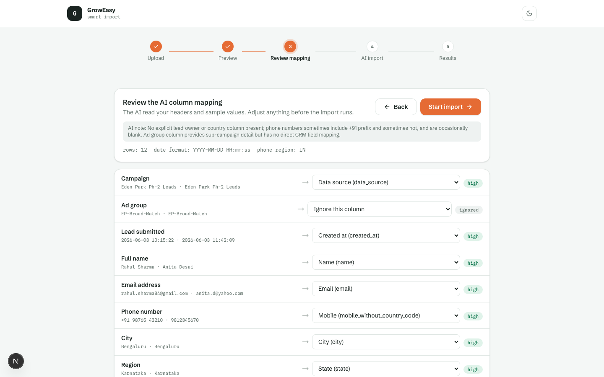
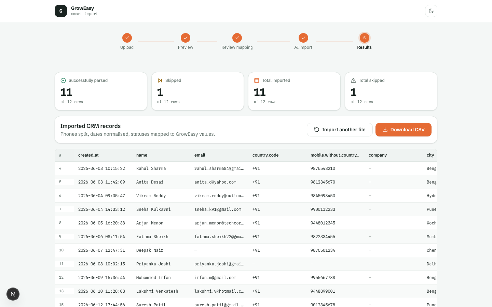
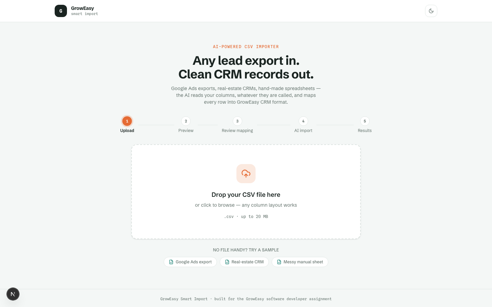
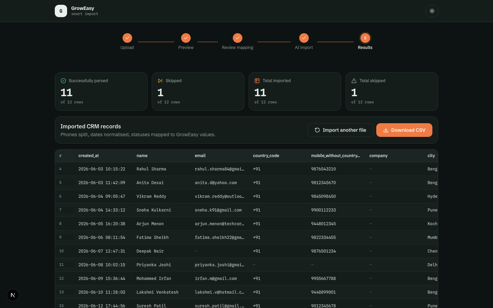
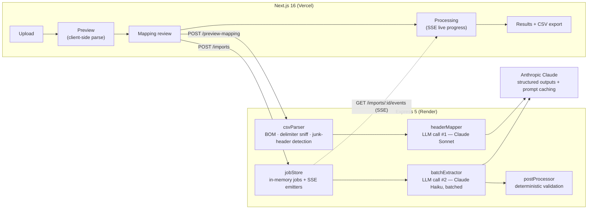

# GrowEasy Smart Import

**AI-powered CSV importer** — upload *any* lead export (Google Ads, real-estate CRM dumps, hand-made spreadsheets) and get clean, validated GrowEasy CRM records out. The AI reads your columns, whatever they're called; deterministic code validates everything it returns.

> **Live demo:** **https://groweasy-smart-import-rudray.vercel.app** · **API:** https://groweasy-smart-import-api.onrender.com/api/health
> *(Render's free tier sleeps after 15 min of inactivity — the first request may take ~40 s to wake the API.)*

Built for the GrowEasy Software Developer assignment.

| AI mapping review | Results |
|---|---|
|  |  |
| **Upload** | **Dark mode** |
|  |  |

---

## Feature checklist

Every requirement and every bonus item:

| | Feature |
|---|---|
| ✅ | Drag & drop upload + file picker (with one-click sample files) |
| ✅ | Client-side CSV preview — sticky header, horizontal + vertical scroll, **no AI involved** |
| ✅ | Confirm step before anything is sent to the backend |
| ✅ | **AI column-mapping review** — Flatfile-style: see what the AI mapped, with confidence badges, and override any column before importing |
| ✅ | Batched AI extraction (30 rows/batch, 4 in parallel) |
| ✅ | Live progress via **Server-Sent Events** — progress bar, batch counter, and a real-time import log; automatic **polling fallback** if the stream drops |
| ✅ | Retry with exponential backoff + jitter, **batch bisection** (a poison row costs one row, not thirty), and row-index reconciliation |
| ✅ | Results table with the four required counts, per-row skip reasons, and field-level warnings |
| ✅ | Download the imported records as CSV |
| ✅ | **Virtualized tables** — a 50k-row file scrolls like a 50-row one |
| ✅ | Streaming/incremental parsing (preview stops at 500 rows; the file is never fully parsed in the browser) |
| ✅ | Dark mode |
| ✅ | 65 unit + integration tests (Vitest) + a Playwright E2E drive script |
| ✅ | Docker (multi-stage images + `docker compose up`) |
| ✅ | Deployed on Vercel (web) + Render (API) |

---

## Architecture



**Monorepo layout** — npm workspaces:

```
packages/shared   Zod schemas + types shared by both apps (single source of truth)
apps/api          Express 5 + TypeScript backend
apps/web          Next.js 16 + Tailwind v4 frontend
fixtures/         4 sample CSVs exercising every edge case (also served in the UI)
```

---

## How the AI pipeline works

The interesting problem isn't parsing CSV — it's that the same fact ("this person's phone number") arrives as `Phone`, `Contact No`, `ph`, or a column called `Info` that happens to contain numbers. The pipeline splits the work by what each part is good at:

### 1. Header mapping — one call, high intelligence
Claude Sonnet receives the **headers + 10 sample rows** and returns a structured mapping: which source column feeds which CRM field, a confidence level per column, the **date format** used (`DD/MM/YYYY` vs `MM/DD/YYYY` — judged across the whole sample, where a day > 12 disambiguates), and the likely phone **country region**. This powers the review UI, so a human can veto the AI before anything is imported.

### 2. Batched row extraction — many calls, cheap and parallel
Claude Haiku processes rows in batches of 30, 4 batches in flight. The model's job is *semantic* work only: recognising that "RNR 3 times" means `DID_NOT_CONNECT`, that "SarjapurPlots-Aug" is the `sarjapur_plots` source, that "Ms. Priya S" is a name with a salutation, and splitting multi-value cells (`9876543210 / 044-2345678`). It returns **raw values** — `phone_raw`, `created_at_raw` — verbatim.

Reliability is layered:
- **Structured outputs (constrained decoding)** — the response is schema-valid by construction; an out-of-enum `crm_status` is *impossible at the wire level*, not just discouraged in the prompt.
- **Prompt caching** — the system prompt is byte-stable across batches and marked `cache_control`, so repeated batches read the prefix at ~10 % of input price.
- **Retries** — SDK-level backoff for 429/5xx (honouring `retry-after`) plus app-level retry with jitter for validation failures.
- **Reconciliation** — every row carries a `row_index` the model must echo back; missing rows are re-queued once, hallucinated or duplicated indexes are dropped.
- **Bisection** — a batch that keeps failing splits in half recursively, so one poison row is quarantined instead of sinking 29 healthy ones.
- **Truncation handling** — `stop_reason: max_tokens` splits the batch rather than retrying it verbatim.

### 3. Deterministic post-processing — zero AI
An LLM is a copy machine that occasionally makes mistakes, so nothing the model returns is trusted where code can verify:
- **Phones** — `libphonenumber-js` does the country-code split (`+91` / `9876543210`), with the mapping step's region as a hint. The LLM never splits numbers.
- **Dates** — normalised with the *column-level* detected format, then asserted against the assignment's rule: `new Date(created_at)` must be valid. Unparseable dates become `null` + a warning — never a guess.
- **Enums** — re-asserted against the allowed values (belt-and-braces over constrained decoding, since providers are swappable).
- **Rules** — first email/phone kept, extras appended to `crm_note`; line breaks flattened so every record stays one CSV row; rows with neither email nor phone skipped; duplicates (same email or E.164 phone) skipped and reported.

Every row is accounted for: `total_rows = imported + skipped + failed`, each skip with a reason and a raw preview — no silent data loss.

---

## API reference

| Method & path | Purpose |
|---|---|
| `POST /api/imports/preview-mapping` | multipart `file` → parse + AI header mapping (no row extraction). Returns the mapping, sample rows, and a `file_token` so the confirm step doesn't re-upload. |
| `POST /api/imports` | multipart `file` *or* `file_token`, optional user-edited `mapping` JSON → `202 { job_id }`; the import runs detached. |
| `GET /api/imports/:jobId` | Polling fallback: status, progress, result. |
| `GET /api/imports/:jobId/events` | **SSE** stream: `status`, `mapping`, `batch`, `done`, `error` events + heartbeats. Late subscribers get a snapshot replay. |
| `GET /api/imports/:jobId/result.csv` | Download the imported records as CSV. |
| `GET /api/health` | Liveness + configured models. |

Errors are always `{ "error": { "code", "message" } }` with a meaningful HTTP status (`EMPTY_FILE`, `FILE_TOO_LARGE`, `JOB_NOT_FOUND`, …).

---

## Running locally

Requires Node ≥ 20 and an [Anthropic API key](https://console.anthropic.com).

```bash
git clone https://github.com/rudraymehra/groweasy-smart-import && cd groweasy-smart-import
npm install
cp apps/api/.env.example apps/api/.env   # put your ANTHROPIC_API_KEY here
npm run dev                               # api on :4000, web on :3000
```

Open http://localhost:3000 and click one of the sample files.

### Docker

```bash
ANTHROPIC_API_KEY=sk-ant-... docker compose up --build
```

### Tests

```bash
npm test                      # 65 unit + integration tests (Vitest)
node scripts/e2e-drive.mjs    # Playwright drive of the full wizard (needs both dev servers)
```

The integration suite runs the whole pipeline against a **mock LLM provider** over the messy fixture and pins exact summary counts — proving the provider abstraction and keeping CI free of API keys.

### Try the fixtures

| File | What it exercises |
|---|---|
| `fixtures/google-ads-leads.csv` | 2 junk title rows above the header, campaign→data_source matching, mixed `+91`/bare phones |
| `fixtures/real-estate-crm-export.csv` | `DD/MM/YYYY` dates, salutations, multi-line remarks, possession times, alt-contact columns |
| `fixtures/messy-manual-sheet.csv` | chaotic headers, two phones/emails per cell, 3 date formats, junk numbers, duplicates |
| `fixtures/edge-cases.csv` | UTF-8 BOM, semicolon delimiter, non-ASCII headers |

---

## Deployment

- **API → Render** (free): new Web Service from this repo · build `npm install && npm run build -w packages/shared -w apps/api` · start `node apps/api/dist/index.js` · env `ANTHROPIC_API_KEY`, `ALLOWED_ORIGIN=<vercel-url>`. SSE works on Render's persistent processes.
- **Web → Vercel** (free): import the repo · root directory `apps/web` · env `NEXT_PUBLIC_API_URL=<render-url>`. Vercel resolves the workspace lockfile from the repo root automatically.

The SSE stream must originate from the Express server (Render) — serverless functions buffer/timeout long-lived responses, which is exactly why the backend isn't deployed to Vercel functions.

---

## Design decisions & tradeoffs

- **Two-stage AI (map once, extract in batches)** instead of pure per-row prompting: the mapping step gives the UI its review screen and gives extraction a cheaper, tighter prompt (only mapped columns are sent — fewer tokens, less noise).
- **Sonnet for mapping, Haiku for extraction** — one hard-reasoning call vs. hundreds of cheap semantic ones. Both configurable via env; the `LLMProvider` interface (`apps/api/src/llm/provider.ts`) makes OpenAI/Gemini a ~50-line addition with zero pipeline changes.
- **In-memory job store** — deliberate for a single-instance assignment app (30-min TTL, documented interface). Multi-instance would swap in Redis behind the same five methods.
- **`multer.memoryStorage()`** — files are capped at 20 MB and parsed immediately; no temp-file lifecycle.
- **Stateless, no database** — the assignment allows it, and it keeps the demo reproducible. Import history would be the first thing a DB adds.

### What I'd build next
Resumable/chunked uploads for very large files · XLSX support · mapping memory ("you mapped `Prospect`→`name` last time") · Redis-backed jobs + horizontal scaling · webhook on completion.
